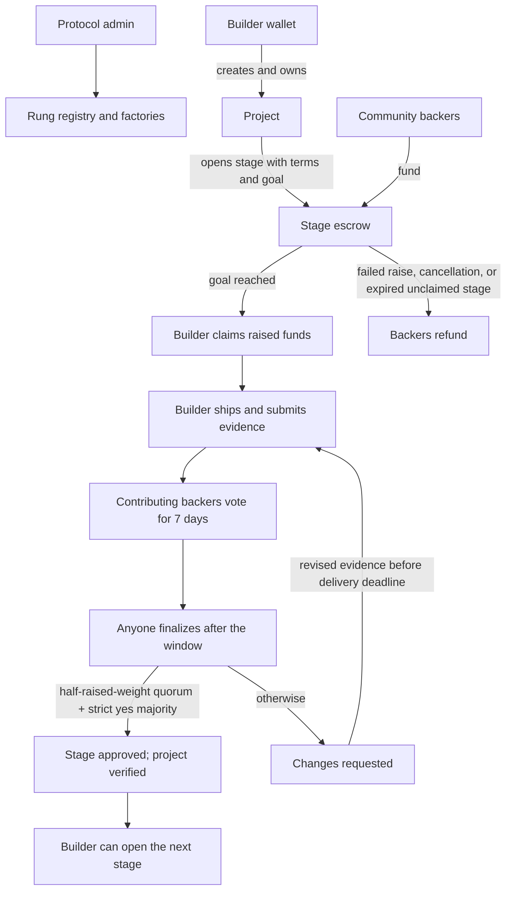
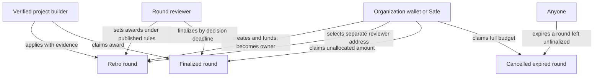

# Rung architecture

The implementation has three separate decision domains. The protocol admin manages
shared safety settings; builders own their projects; and organizations control the
retro rounds they create. Milestone review belongs to the community that funded that
stage.

## Role boundaries

| Actor | Owns or controls | Does not control |
| --- | --- | --- |
| Protocol admin | Shared asset allowlist and creation pause | Project review, organization rounds, or award decisions |
| Project builder | Their project, stage terms, delivery, and evidence | Community vote outcome |
| Stage backers | Vote on evidence for the stage they funded | Other projects or retro awards |
| Round creator / organization | Owns and funds its round; receives its unallocated budget | Other organizations' rounds or crowdfunding stage votes |
| Round reviewer | Sets awards and finalizes that one round | Other rounds or stage milestone decisions |

“Owner” is always scoped: **protocol admin**, **project builder**, or **round owner**.
The wallet or Safe that creates and funds a round is its owner and treasury by default.
The round snapshots a separate reviewer address at creation. One address is configured;
an organization can use a Safe when its review process needs multiple people.

There is no platform-wide reviewer or arbiter. The stage model has no appeal function:
a failed or under-quorum vote requests changes, and the builder can submit revised
evidence for another vote before the delivery deadline. A later product change can add
a stage-scoped dispute path if the team defines its authority and safeguards.

## Crowdfunding flow

Each backer gets voting weight equal to their total contribution to that stage. A
backer may vote once per evidence submission. The builder cannot fund their own stage.
Approval requires participation of at least half the total amount raised and strictly
more yes weight than no weight. A tie or missed quorum requests changes. The vote closes
seven days after evidence is submitted; anyone can finalize after it closes. A new
evidence submission starts a new vote and resets the vote totals.

Only an approved milestone marks the project verified and advances its stage number.
If the raise fails, the builder cancels before claiming, or the builder does not claim
before delivery expiry, backers can refund. Claims and refunds remain mutually
exclusive.

## Organization retrofunding flow

Any wallet or Safe can create a round; there is no on-chain organization registry yet.
The creator escrows the full budget and is permanently recorded as `roundOwner` and
`treasury`. The reviewer is scoped to that round. Only the reviewer may set awards and
finalize during the decision window. Builders claim their own awards after finalization.
The round owner claims the unallocated balance; if the reviewer never finalizes, anyone
can expire the round after the decision deadline so the owner can reclaim its budget.

## Shared platform controls

`Rung` is a registry and factory; it does not custody campaign or round funds. Its
protocol admin can allowlist ERC-20 assets and pause creation. Pausing blocks new
projects, stages, and rounds, but does not block refunds, claims, or other exits. Native
BOT is enabled by default. The event indexer is a read model; onchain state is the
financial and authorization source of truth.

## Open policy decisions

- Whether rounds need an onchain organization identity, multiple reviewer addresses, or
  a reviewer panel beyond a Safe controlled by the organization.
- Whether to add an appeal/dispute path for stage votes and what safeguards it needs.
- Whether an organization needs post-creation ownership transfer or cancellation.
- Whether stage voting power should ever use a contribution snapshot instead of the
  escrow's current contribution mapping.

Current contract interfaces, UI, indexer, and test fixtures implement the rules above.
Release tasks and testnet deployment gates are tracked in
[`release-readiness.md`](release-readiness.md).
